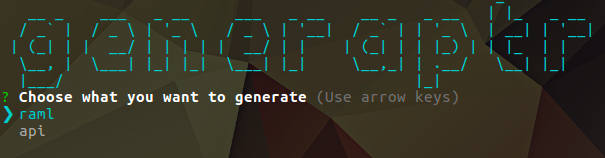
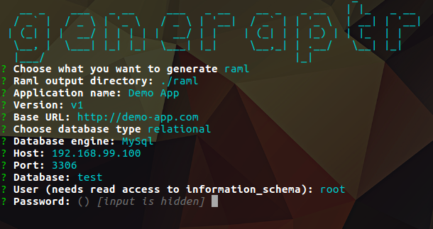
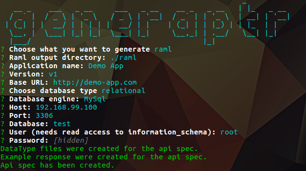
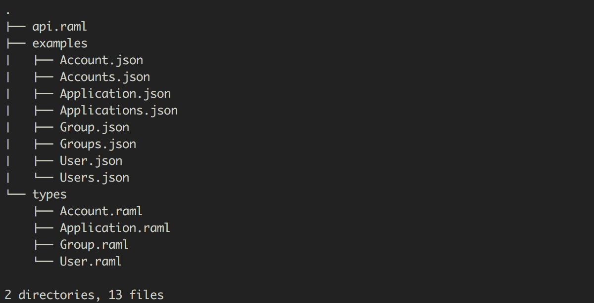

========

[](http://badge.fury.io/js/generaptr)[](http://travis-ci.org/cupsadarius/generaptr) [](https://gitter.im/generaptr/proposals?utm_source=badge&utm_medium=badge&utm_campaign=pr-badge&utm_content=badge) [](https://coveralls.io/github/cupsadarius/generaptr?branch=develop)[](https://david-dm.org/cupsadarius/generaptr)

Generaptr is a node cli package that helps when starting up a package by generating boilerplate code for Express api.

-------
## Table of Contents
1. [Documentation](#documentation)
2. [Minimum Requirements](#minimum-requirements)
3. [Installation](#instalation)
4. [Examples](#examples)
5. [Support](#support)
6. [Code of Conduct](#code-conduct)
7. [Contributing](#contributing)
8. [License](#license)
9. [References](#references)

## Goal and Philosophy
**`Generaptr`** strives to be an easy and useful command line tool for generating boilerplate api for a given database structure.
 
**`Generaptr`** should ease the process of:
- starting a new backend project
- writing boilerplate crud operations
- writing api specs

## [Documentation](#documentation)
<a name="documentation"></a>
### [Minimum Requirements](#minimum-requirements)
<a name="minimum-requirements"></a>
The package was developed under `node 7.5` so a minimum requirement would be:
* `node >= v7.5.0`
* `npm >= v3.10.10`
### [Installation](#instalation)
<a name="instalation"></a>

``` shell
npm install generaptr
```

### [Examples](#examples)
<a name="examples"></a>

When starting generaptr the screen displayed below will appear.



Here, the two possible actions are shown, actions which will decide on which flow will the execution continue:
* [raml](#raml-flow)
* [api](#api-flow)
#### [Generate Raml spec flow](#raml-flow)
<a name="raml-flow"></a>

Required information for generating the raml api spec is presented in the next screen.
 




In the screenShot we can see the logs from a successful api spec generation.



Folder structure for a generated api spec.

#### [Generate Api flow](#api-flow)
<a name="api-flow"></a> 

Required information for generating the api boilerplate is presented in the next screenShot.


## [Support](#support)
<a name="support"></a>
You should expect mostly good support for the CLI below. This does not mean we won't
look at issues found on other command line - feel free to report any!

- **Mac OS**:
  - Terminal.app
  - iTerm
- **Windows**:
  - cmd.exe
  - Powershell
  - Cygwin
- **Linux (Ubuntu, openSUSE, Arch Linux, etc)**:
  - gnome-terminal (Terminal GNOME)
  - konsole
## [Code of Conduct](#code-conduct)
<a name="code-conduct"></a>

See [Code of Conduct](./CODE_OF_CONDUCT.md) for more information.
## [Contributing](#contributing)
<a name="contributing"></a>

**Unit test**

Unit test are written in [Mocha](https://mochajs.org/) and [Assert](https://nodejs.org/api/assert.html). Please add a unit test for every new feature or bug fix. `npm test` to run the test suite.

**Documentation**

Add documentation for every API change. Feel free to send typo fixes and better docs!

## [License](#license)
<a name="license"></a>

Copyright (c) 2017 Darius Cupsa (twitter: [@cupsadarius](https://twitter.com/cupsadarius))
Licensed under the GPL-3.0 license.
## [References](#references)
<a name="references"></a>
* [RAML](http://raml.org)
* [Inquirer.js](https://github.com/SBoudrias/Inquirer.js/)
* [Express.js](https://expressjs.com)

